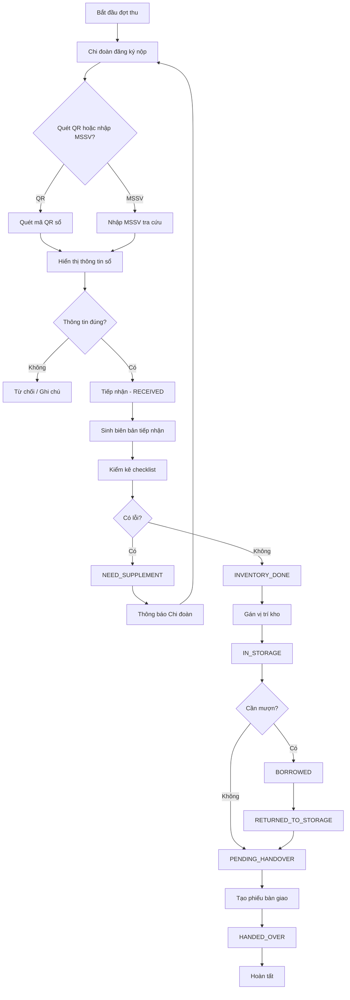
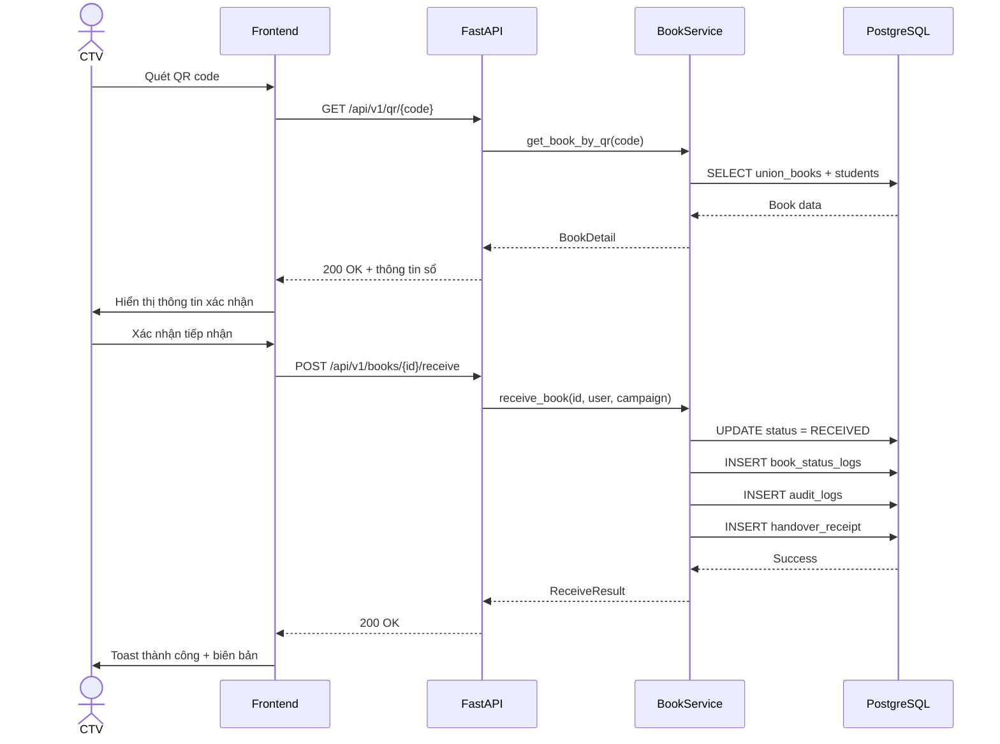

# 2-4. Sơ đồ Use Case, Activity, Sequence

## 2. Use Case Diagram

```mermaid
graph TB
    subgraph Actors
        SA[Super Admin]
        DT[Đoàn trường]
        LCD[Liên Chi đoàn]
        BT[Bí thư Chi đoàn]
        CTV[CTV]
        DV[Đoàn viên]
    end

    subgraph System["Hệ thống Quản lý Sổ Đoàn"]
        UC1[Quản trị người dùng]
        UC2[Xem Dashboard]
        UC3[Quản lý đoàn viên]
        UC4[Quản lý sổ đoàn]
        UC5[Tạo đợt thu]
        UC6[Tiếp nhận sổ - QR/MSSV]
        UC7[Kiểm kê sổ]
        UC8[Quản lý kho]
        UC9[Mượn/Trả sổ]
        UC10[Bàn giao sổ]
        UC11[Xem lịch sử]
        UC12[Xuất báo cáo]
        UC13[Tra cứu sổ]
        UC14[Nhận thông báo]
    end

    SA --> UC1
    SA --> UC2
    DT --> UC2
    DT --> UC12
    LCD --> UC2
    LCD --> UC5
    LCD --> UC6
    LCD --> UC7
    LCD --> UC8
    LCD --> UC9
    LCD --> UC10
    LCD --> UC12
    BT --> UC3
    BT --> UC4
    BT --> UC5
    CTV --> UC6
    CTV --> UC7
    CTV --> UC8
    CTV --> UC9
    DV --> UC13
    DV --> UC14
```

## 3. Activity Diagram - Quy trình thu sổ

```mermaid
flowchart TD
    A[Bắt đầu đợt thu] --> B[Chi đoàn đăng ký nộp]
    B --> C{Quét QR hoặc nhập MSSV?}
    C -->|QR| D[Quét mã QR sổ]
    C -->|MSSV| E[Nhập MSSV tra cứu]
    D --> F[Hiển thị thông tin sổ]
    E --> F
    F --> G{Thông tin đúng?}
    G -->|Không| H[Từ chối / Ghi chú]
    G -->|Có| I[Tiếp nhận - RECEIVED]
    I --> J[Sinh biên bản tiếp nhận]
    J --> K[Kiểm kê checklist]
    K --> L{Có lỗi?}
    L -->|Có| M[NEED_SUPPLEMENT]
    M --> N[Thông báo Chi đoàn]
    N --> B
    L -->|Không| O[INVENTORY_DONE]
    O --> P[Gán vị trí kho]
    P --> Q[IN_STORAGE]
    Q --> R{Cần mượn?}
    R -->|Có| S[BORROWED]
    S --> T[RETURNED_TO_STORAGE]
    R -->|Không| U[PENDING_HANDOVER]
    T --> U
    U --> V[Tạo phiếu bàn giao]
    V --> W[HANDED_OVER]
    W --> X[Hoàn tất]
```

## 4. Sequence Diagram - Tiếp nhận sổ qua QR

```mermaid
sequenceDiagram
    actor CTV
    participant FE as Frontend
    participant API as FastAPI
    participant SVC as BookService
    participant DB as PostgreSQL

    CTV->>FE: Quét QR code
    FE->>API: GET /api/v1/qr/{code}
    API->>SVC: get_book_by_qr(code)
    SVC->>DB: SELECT union_books + students
    DB-->>SVC: Book data
    SVC-->>API: BookDetail
    API-->>FE: 200 OK + thông tin sổ
    FE->>CTV: Hiển thị thông tin xác nhận
    CTV->>FE: Xác nhận tiếp nhận
    FE->>API: POST /api/v1/books/{id}/receive
    API->>SVC: receive_book(id, user, campaign)
    SVC->>DB: UPDATE status = RECEIVED
    SVC->>DB: INSERT book_status_logs
    SVC->>DB: INSERT audit_logs
    SVC->>DB: INSERT handover_receipt
    DB-->>SVC: Success
    SVC-->>API: ReceiveResult
    API-->>FE: 200 OK
    FE->>CTV: Toast thành công + biên bản
```
